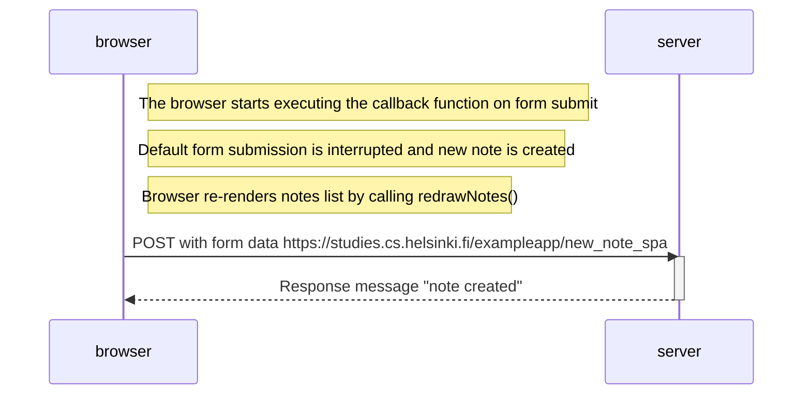

# Sequence diagram for creating a new note in Single Page Application

```mermaid
sequenceDiagram
    participant browser
    participant server

    Note right of browser: The browser starts executing the callback function on form submit
    Note right of browser: Default form submission is interrupted and new note is created
    Note right of browser: Browser re-renders notes list by calling redrawNotes()
    browser->>server: POST with form data https://studies.cs.helsinki.fi/exampleapp/new_note_spa
    activate server
    server-->>browser: Response message "note created"
    deactivate server
```